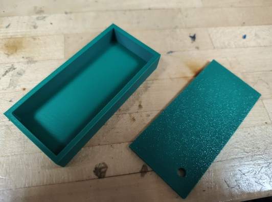

# Proximity_Alarm

Buzzer Noise Device Component

**Bill of Materials**

| **Item(s)** | **Description** | **Qty** | **Vendor ** | **Unit Cost (\$)** | **Cost (\$)** |
|----|----|----|----|----|----|
| **XIAO ESP32C3 MCU Board** | **Microcontrollers with Bluetooth to track distance between items** | **2** | [**seed studio (via Amazon)**](https://www.amazon.com/Seeed-Studio-XIAO-ESP32C3-Microcontroller/dp/B0DGX3LSC7?th=1) | **6.67** | **13.34** |
| **Buzzer Alarm Sounder** | **Buzzer intended to activate when items are separated** | **2** | [**HiLetgo (via Amazon)**](https://www.amazon.sg/HiLetgo-Integrated-Sounder-Speaker-Electromagnetic/dp/B09L4K1PMF?th=1) | **1.04** | **2.08** |
| **Rechargeable Battery** | **Battery to supply voltage to microcontroller** | **2** | [**MakerFocus (via Amazon)**](https://www.amazon.com/MakerFocus-Rechargeable-Protection-Insulated-Development/dp/B08T6GT7DV?th=1) | **6.52** | **13.04** |
| **3D Printer Filament** | **3D printed casing for device** | **0.67 oz** | [**HZST3D (via Amazon)**](https://www.amazon.com/HZST3D-PETG-Filament-Material-Printing/dp/B0BHKD7YN3/ref=asc_df_B0BHKD7YN3?mcid=1ef3477f44bc3af9aaaccbd1e5edd048&hvocijid=7277559224644812762-B0BHKD7YN3-&hvexpln=73&tag=hyprod-20&linkCode=df0&hvadid=721245378154&hvpos=&hvnetw=g&hvrand=7277559224644812762&hvpone=&hvptwo=&hvqmt=&hvdev=c&hvdvcmdl=&hvlocint=&hvlocphy=9021565&hvtargid=pla-2281435177338&th=1) | **0.40 per oz** | **0.27** |
| **Total Cost (\$)** | **28.73** |  |  |  |  |

Tools/Machines

- 3D Printer

- Soldering Iron

- Wire Strippers

- Hot GLue Gun

Special Conditions

- N/A

Safety Risks/Notes

- Heat-Based Devices (3D Printer, Soldering Iron, Hot Glue Gun):

o   Do NOT touch heated surfaces (nozzles, beds, etc.) until fully
cooled.

o   Do NOT touch melted material (filament, solder, glue) during
operation.

o   Allow sufficient cooling time for wires, PCB boards, and components
near solder joints. Heat can conduct through these parts.

o   Work in a well-ventilated area.

- Superglue

o   Work in a well ventilated area.

**Step 1: 3D Printing**

1.  **File Locations:**

> o   **GitHub
> ([<u>link</u>](https://github.com/JacsTree/Proximity_Alarm)):**
>
> o Assembly_1.stl
>
> o Buzzer_Client_Battery.ino
>
> o Buzzer_Server_Battery.ino

1.  **Printing Instructions:**

> o   Combine all files into a single print job if your build plate is
> large enough
>
> o   **Slicer Settings:**
>
> §  Wall Thickness: 1.0 mm
>
> §  Infill: 50%
>
> §  Supports: None
>
> §  Recommended Slicers: Cura Slicer, PrusaSlicer, or Bambu Studio
>
> o   **Placement:** Ensure models are *not* overlapping on the build
> plate

1.  **Slice and Upload:** Slice the files using your chosen slicer and
    upload them to your 3D printer. Follow your printer's specific
    instructions for uploading files.

**Step 2: Wire Together Electronics**

1.  **Cutting:** 

> o Cut two short (~1”) strips of wire and strip off the last 4mm at the
> end.
>
>  alt="A small round object with red wires on a wooden surface AI-generated content may be incorrect." />
>
> Figure 19: Buzzer wires.
>
> o Cut the wire lead coming off the battery connector. Avoid shorting
> the contacts by doing this one side at a time.
>
>  alt="A close-up of a couple of plugs on a wood surface AI-generated content may be incorrect." />
>
> Figure 20: Battery connectors cut off

1.  **Soldering:** A wiring diagram is provided for your convenience as
    well:

> Figure 21: Wiring diagram
>
> o   Solder each of the wires to one pin of the buzzer
>
> 
>
> Figure 22: Wires on Buzzer
>
> o Solder the battery’s lead wires to the XIAO Esp32’s underside
> battery connector pads. (Red is +, black is -)
>
> 
>
> Figure 23: Battery leads to Xiao
>
> o Solder The buzzer leads to GPIO 9 and Gnd. There is a small + on one
> side of the buzzer and that should be the side going to GPIO 9
>
> 
>
> Figure 24: Final Solder
>
> o   Finish by attaching the bluetooth antenna to the XIAO
>
> 
>
> Figure 25: Final Wiring

1.  **Assembly:**

> o  Grab box off of 3D printer
>
>  alt="A green box with a hole in it AI-generated content may be incorrect." />
>
> Figure 26: 3D Printed box
>
> o   Cut small Hole for esp32
>
> 
>
> Figure 27: Hole Cut in Box
>
> o   Fit electronics inside and hot-glue them in place
>
>  style="width:2.65833in;height:1.99167in" />
>
> Figure 28: Finished interior of box
>
> o Upload code from Arduino IDE and test functionality. You may need to
> reset the ESP32 using its reset button after uploading.
>
> 
>
> Figure 29: Device beeping
>
> o Finally affix the lid with superglue/hot glue, and finish charging
>
>  alt="A green rectangular object on a wood surface AI-generated content may be incorrect." />
>
> Figure 30: Completed Buzzer Noise Device Component
